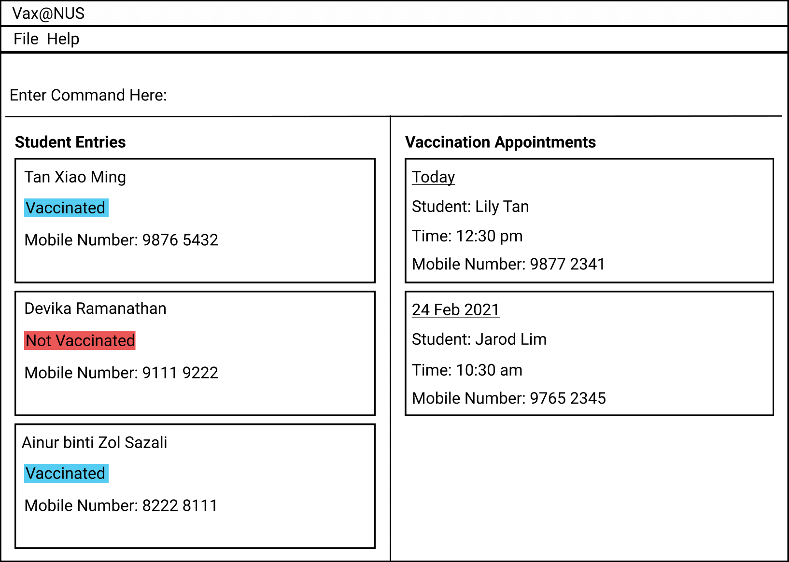

* Vax@NUS is an app for **staff at the NUS University Health Centre (UHC)**
  to keep track of the COVID-19 vaccination status of students.  
* It is targeted at staff who are **proficient and comfortable with the
  Command Line Interface (CLI)**, as the app will have very limited UI interaction features.

### Example usages:

* Create, read, update and delete (CRUD) of student profiles which details critical information such as:
    * Contact information
    * Vaccination status
        * If not vaccinated, their preference for vaccination (yes/no)
    * Medical history, existing medical conditions and allergies
* Creating and managing vaccination appointments for students

### Problems addressed:

* Eliminates the need for the university to use the Ministry of Health's database.
* This in turn simplifies the process of contacting, monitoring and administering vaccines for students.
* Consolidates and streamlines only data relevant to vaccinations into one app.
* **Goal:** To create a COVID-free NUS campus where student and academic life can flourish without restrictions.

### Planned Features:

#### v1.2

1. On top of the fields already available in AB3, the user will be able to input the following:
    * Student's matriculation number
    * Vaccination status/preference
    * Faculty
    * Residence on campus (if applicable)
    * Medical history
1. A filter function that will allow the user to display a specific group of students
1. The user will be able to view all the detailed information of a student at a glance. Currently, only
   the summarised information on the UI can be viewed.
1. Create vaccination appointments and display them on the UI.

#### v1.3

1. Detect duplicate entries.
1. Sort vaccination appointments and display only upcoming ones.
1. Provide statistical insights regarding the vaccination of the student population, by faculty, residence or other
   relevant parameters.
1. Undo feature to quickly correct accidental mistakes.

>For the detailed documentation of this project, see the
**[Vax@NUS Website](https://ay2021s2-cs2103t-w10-4.github.io/tp/)**.

This project is based on the AddressBook-Level3 project created by
the [SE-EDU initiative](https://se-education.org).